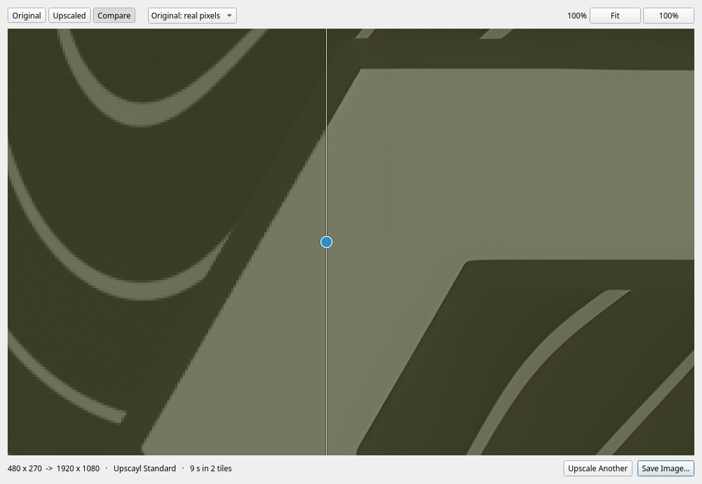

# Local Upscaler

Enlarge images with AI upscaling models, entirely on your own machine. Nothing is
uploaded anywhere.

Open an image, pick a model, and watch a real progress bar. When it finishes you
get three views of the result — the original, the upscaled version, and a
before/after wipe you can drag across to see exactly which pixels changed — then
save it if you like it.



## Why it does not use PyTorch

This was written for a GeForce GTX 1050 Ti, which is Pascal — compute capability
`sm_61`. **CUDA 13.0 removed offline compilation for everything below `sm_75`**,
and Arch's `python-pytorch-cuda` is built against CUDA 13.3, so it contains no
kernels that card can run: PyTorch there is silently CPU-only, and the pip wheels
are no better (Pascal was dropped from the cu128/cu129 builds, and `cp314` wheels
only exist for torch ≥ 2.10).

Vulkan is unaffected. So the engine is [`realesrgan-ncnn-vulkan`][engine], an
11 MB standalone binary that runs its convolutions as Vulkan compute shaders. On
the same card that PyTorch cannot use at all, it upscales a 1080p photo to 4x in
about a minute and a half, and never exceeds 1.7 GB of the 4 GB of VRAM.

[engine]: https://github.com/xinntao/Real-ESRGAN-ncnn-vulkan

## Requirements

Hard requirements — the app will not start without these:

```fish
sudo pacman -Syu
sudo pacman -S --needed pyside6 python-pillow python-numpy vulkan-icd-loader
```

> Run the full `-Syu` first. `pyside6` is ABI-locked to `qt6-base`, and a partial
> upgrade breaks it immediately.

You also need a Vulkan driver for your GPU (`nvidia-utils`, `vulkan-radeon` or
`vulkan-intel`) — or nothing at all, if you set **Device: CPU only** and are
patient.

Then the engine itself, either from the AUR:

```fish
paru -S realesrgan-ncnn-vulkan-bin      # or: paru -S upscayl-ncnn
```

…or let the app fetch its own copy, which needs no AUR helper and no root:

```fish
python3 -m local_upscaler --fetch-engine
```

`docs/COMPATIBILITY.md` explains what each dependency is for and what breaks
without it.

## Install

```fish
git clone https://github.com/Merligus/local-upscaler.git
cd local-upscaler
python3 -m local_upscaler --fetch-engine     # skip if you installed the AUR package
python3 -m local_upscaler --install          # adds it to the application menu
```

There is no `pip install` and no virtualenv — see `docs/COMPATIBILITY.md` for
why. `--install` writes only to `~/.local/share`, never system-wide, and
`--uninstall` reverses it.

## Usage

```fish
bin/local-upscaler                  # or launch it from the application menu
bin/local-upscaler photo.jpg        # start with an image already loaded
```

Images also offer it under **Open With** once `--install` has been run.

Inside the result view: drag to pan, scroll to zoom, double-click to toggle
between fit and 100%. `0` fits, `1` goes to 100%, `+`/`-` zoom. In **Compare**,
drag the vertical handle to wipe between before and after.

### Command line

```fish
python3 -m local_upscaler --list-models             # the catalog, and what you have
python3 -m local_upscaler --fetch-models ultrasharp-4x remacri-4x
python3 -m local_upscaler --fetch-models all        # all 16, about 431 MB
python3 -m local_upscaler --bench                   # measure your own machine
```

## How long it takes

Measured on the development machine — GTX 1050 Ti (4 GB, Pascal), 12 GB RAM, at
the default GPU tile of 128 — upscaling to 4x:

| Input | Upscayl Standard | Upscayl Lite |
|---|---|---|
| 512 x 512 | 15 s | 2 s |
| 1024 x 1024 | 49 s | 5 s |
| **1920 x 1080** | **1 min 32 s** | **9 s** |
| 4000 x 3000 (12 MP) | ~9 min | ~45 s |

The first three rows are measured; the last is extrapolated from the fitted rate
of 44 s per input megapixel (Standard) and 4.4 s/MP (Lite). VRAM peaked at
1.7 GB of 4 GB on the 1080p run.

The other models fall between those two columns: the 32 MB ones (UltraSharp,
Remacri, Nomos8kSC, LSDIRplusC, HFA2k, UltraMix, High Fidelity) behave like
Standard, the 64 MB NMKD ones take roughly twice as long, and the 1-3 MB compact
ones (Anime Video v3, LSDIR Compact C3, General v3) behave like Lite.

**You do not have to trust any of this.** The app times every run and uses your
own measurements for its estimates from the second run onward, and `--bench`
fills the table in directly.

## The models

Sixteen models, downloaded on demand from Upscayl's
[bundled][upscayl-models] and [custom][custom-models] model repositories — the
ncnn conversions of models catalogued on [OpenModelDB][omdb].

| Model | Scale | Best for |
|---|---|---|
| `upscayl-standard-4x` | 4x | General photos. Real-ESRGAN x4plus — the safe default |
| `ultrasharp-4x` | 4x | Crisp detail; strongest on JPEG-compressed sources |
| `remacri-4x` | 4x | Photographic detail without the plastic over-smoothing |
| `ultramix-balanced-4x` | 4x | Gentler; less aggressive on faces and skin |
| `high-fidelity-4x` | 4x | Stays closest to the source, invents least |
| `digital-art-4x` | 4x | Illustration, flat colour, line art |
| `upscayl-lite-4x` | 4x | Ten times faster, slightly softer |
| `realesr-animevideov3` | **2x/3x/4x** | Anime and cartoons; the only source of 2x and 3x |
| `4xNomos8kSC` | 4x | Photorealistic, modern training set |
| `4x_NMKD-Siax_200k` | 4x | Clean or lightly compressed photos; strong detail |
| `4x_NMKD-Superscale-SP_178000_G` | 4x | Artifact-free real-world images |
| `4xLSDIRplusC` | 4x | High quality on compressed sources |
| `4xLSDIRCompactC3` | 4x | Fast, handles compression artifacts well |
| `4xHFA2k` | 4x | Anime stills and artwork |
| `RealESRGAN_General_x4_v3` | 4x | Compact general-purpose net |
| `uniscale_restore` | 4x | Restoration of degraded or noisy originals |

Most are 4x only. To get a smaller result, **Advanced → Output size** runs the 4x
model and downsamples with Lanczos, which beats any native 2x model available
here.

Several are licensed **CC-BY-NC-SA** (non-commercial). The app shows each model's
licence under the picker; the authoritative statement is the model's OpenModelDB
page. Nothing is redistributed by this repository — models are fetched from their
original hosts at runtime.

[upscayl-models]: https://github.com/upscayl/upscayl/tree/main/resources/models
[custom-models]: https://github.com/upscayl/custom-models
[omdb]: https://openmodeldb.info/

## Troubleshooting

| Symptom | Cause |
|---|---|
| "No upscaling engine found" | Run `--fetch-engine`, or install the AUR package |
| "The GPU ran out of memory" | Lower **Advanced → GPU tile** to 64, or set **Device: CPU only** |
| "No Vulkan device was found" | No Vulkan driver. Install `nvidia-utils` / `vulkan-radeon` / `vulkan-intel`, or use CPU |
| App is in Portuguese | It should not be — `QLocale` is pinned to English. File a bug |
| Menu entry missing after `--install` | Log out and back in, or run `kbuildsycoca6 --noincremental` |
| Icon missing in the launcher | A stale `~/.local/share/icons/hicolor/icon-theme.cache`. `--install` removes it; delete it by hand if needed |
| A visible seam in the output | Set **Advanced → Tiling: Single pass** and file a bug with the image |
| Result is huge / runs out of RAM | A 12 MP source at 4x is a 192 MP image. Use **Output size** to ask for less |

## Development

```fish
python3 tests/test_tiling.py            # the tile geometry — the load-bearing one
python3 tests/test_catalog.py
python3 tests/test_settings.py
python3 tests/test_desktop_and_help.py
```

No test framework: each file is a standalone script that prints `PASS`/`FAIL` and
exits non-zero if anything failed, matching the soundboard project's convention.
They need no display, no GPU and no network.

| Document | What it covers |
|---|---|
| `docs/COMPATIBILITY.md` | What each dependency is for, and what degrades without it |
| `docs/TODO.md` | Known gaps and what is planned, including the online-API version |
| `local_upscaler/engine/tiling.py` | Why tiles exist, and the measurements behind the context margin |

## Licence

MIT — see `LICENSE`. This covers the application code only. The upscaling models
and the engine binary have their own licences and are not distributed here.
